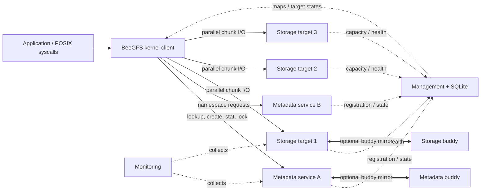

# BeeGFS 架构与产品定位

## 1. 技术摘要

BeeGFS 是一个面向 Linux 集群的共享并行文件系统。它把命名空间和文件属性放在 metadata services，
把文件内容按条带分布到 storage targets，并让内核客户端直接访问两者。Management service 负责注册、
拓扑、目标状态、容量池、存储池和 Buddy Group 映射，但不代理稳态文件 I/O。

从分布式存储工程视角，BeeGFS 的优点来自“少做一层”：不引入分布式块设备，不为每个数据 target 建立
Raft group，也不把客户端数据经由统一 gateway；metadata/storage daemon 直接复用本地 Linux 文件系统，
客户端在内核中完成条带计算和并发 fan-out。这使其非常适合大量计算节点并行读写大文件，但把以下责任留给部署者：

- 本地磁盘冗余、端到端校验、静默损坏检测依赖底层 RAID/ZFS/硬件和运维体系；
- 强一致访问需要正确配置缓存、全局锁和同步策略，不能依赖默认值；
- 控制面数据库、Buddy Group 故障域和大目录布局需要在上线前显式设计；
- EC、透明快照、跨地域复制等能力不属于核心条带数据路径。

## 2. 组件拓扑

图中的实线是文件操作主路径，虚线是控制/监控路径。官方
[Architecture Overview](https://doc.beegfs.io/latest/architecture/overview.html) 强调：客户端知道目标位置，
数据不通过 metadata 或 management 转发。这一特征决定了 BeeGFS 的横向吞吐能力，也意味着客户端模块是协议、
缓存、一致性和错误恢复的重要参与者，而不是薄挂载层。

### 2.1 核心组件

| 组件 | 实现/部署 | 权威状态 | 是否进入数据路径 | 扩展方式 |
|------|-----------|----------|------------------|----------|
| Client | Linux 内核模块；每个计算节点挂载 | open/session、缓存、布局副本 | 是，直接访问 meta/storage | 增加客户端；注意连接和服务端 worker 数 |
| Metadata | C++ 用户态服务，本地 ext4/XFS/ZFS | 目录 inode、dentry、文件 inode、stripe pattern | 仅元数据路径 | 增加 metadata services；按目录分布 |
| Storage | C++ 用户态服务，本地 XFS/ext4/ZFS | 每个 target 上的 chunk 文件 | 是 | 增加 storage targets/nodes |
| Management | Rust 用户态服务 + SQLite | 节点/target、pool、buddy、root owner、状态 | 否，但挂载、放置和故障切换依赖它 | 单权威实例；外部 HA 保护 |
| `beegfs` CLI | Go | 无，调用 gRPC/BeeMsg | 否 | 运维入口 |
| Monitoring | C++ 服务，向时序后端输出 | 非权威指标 | 否 | 可选 |
| fsck | C++ 离线/在线检查工具 | 临时本地检查 DB | 修复时会改数据 | 按目标并行扫描 |
| Remote/Sync/Watch | Go，8.x 扩展服务 | 异步 job、事件 checkpoint、远端对象映射 | 不在普通读写主路径 | Sync workers 横向扩展 |

`ThinkParQ/beegfs` 的 `README.md` 明确说明 8.x 代码拆分：原有内核客户端、metadata、storage、fsck 仍在
C/C++ 仓库；新 management 在 Rust 仓库，新 CLI 与一部分数据管理组件在 Go 仓库，协议定义在 protobuf 仓库。

### 2.2 Node、Service 与 Target

BeeGFS 的“服务”和“目标”不能混为一谈：

- 一个物理/虚拟节点可以运行一个或多个 metadata/storage service；
- 一个 storage service 可暴露多个 storage targets，每个 target 通常对应一个独立本地文件系统/RAID volume；
- Metadata 与 storage 的用户可见模型不同：一个 metadata service 管理自己的 metadata store，不能像 storage service
  那样挂多个独立 storage targets；management 内部仍用 target-like ID/state 统一管理其容量、一致状态和 Buddy 映射；
- target ID 是布局中持久引用，不能把主机名/IP 当作数据位置标识；
- Buddy Group 暴露 group ID，内部映射 primary/secondary target，切换时文件布局不需要改写。

因此扩容不是“把一块盘塞进已有文件的条带”。新 target 会进入后续放置候选，旧文件的不可变条带向量保持不变；
已有数据需要显式重平衡/迁移，不能期待增加节点自动均匀化全部历史数据。

## 3. 一次文件访问如何工作

### 3.1 路径解析与 open

1. 客户端从 root owner 开始，按路径逐级向相应 metadata owner 查询。
2. 目录 dentry 返回下一级对象的 EntryID、owner 和类型；缓存命中时可省略部分 RPC。
3. 文件 inode 中包含 stripe pattern：chunk size、target 数量和目标 ID/Buddy Group ID 向量。
4. `open` 建立客户端/metadata/storage 会话所需状态；metadata 不承载后续每个数据包。

### 3.2 read/write

客户端按文件逻辑 offset 计算 chunk 边界和 target index，把一个大请求拆成若干 target-local 请求，
并对多个 target 并行发送。storage service 打开/复用本地 chunk 文件句柄并执行 `pread`/`pwrite`。
镜像布局下，请求发到当前 primary，由 primary 向 secondary 复制；客户端通常不需要知道物理副本切换细节。

### 3.3 close/stat

文件大小不是由某个 storage target 单独权威维护。写会话关闭时，metadata 汇集各条带 chunk 的动态属性并持久化；
当仍存在写会话、metadata 标记动态属性过期时，`stat` 会向所有相关 storage targets 查询并重建逻辑 size/mtime。
这避免了每次写都同步更新 metadata，但让精确 `stat` 成本随条带 target 数增长。

更详细的请求序列见 [beegfs-data-path.md](beegfs-data-path.md)，语义边界见
[beegfs-consistency.md](beegfs-consistency.md)。

## 4. 元数据扩展模型

### 4.1 目录是分布/并发单元

新建目录时，当前 metadata service 从可用 metadata capacity pool 和偏好列表中选择一个 owner；该目录的
inode 和全部子项 dentry 由这个 owner 管理。子目录可以被放到另一服务，因此一棵宽而深的命名空间可自然分散。

这不是 DNE striped directory 或按 hash/range 分片的目录：

- 同一目录内的文件名不会按 hash 分到多个 metadata services；
- 单目录 create/unlink/readdir/rename 的并行上限受该 owner、它的 buddy 和底层目录限制；
- 热点会随“目录归属”迁移，不会仅靠增加 metadata 节点自动拆分；
- 跨 owner rename 需要多次 RPC 和补偿逻辑，复杂度高于同目录的本地 rename。

官方 metadata tuning 页面即使建议 ext4 `large_dir` 支持超过一千万 entries，也明确不推荐把大量条目放进单一目录。
对声称“支持十亿文件”的系统，必须区分总命名空间规模和单目录规模。

### 4.2 数据放置是文件级不可变布局

目录保存默认 stripe pattern，新建文件继承/按当前容量池选择目标；文件一旦创建，其 target 列表和 chunk size
基本固定。修改目录默认值只影响新文件。优势是客户端映射无中间索引查询，代价是在线调整条带宽度、处理倾斜和
迁移历史数据更复杂。

## 5. 放置与池

### 5.1 Capacity Pools

Management 根据空间和 inode 余量把 target 分类为 `Normal`、`Low`、`Emergency` 等容量层级，分配优先从健康、
容量充足的候选中进行。这里的 pool 是调度反馈，不是数据复制协议：

- 它降低新分配继续压垮低空间 target 的概率；
- 不会自动修复已存在的热点或历史不均衡；
- metadata 和 storage 都可能受“空间”和“可用 inode”两种资源限制；
- 阈值必须结合 target 大小和应急空间配置，不能机械沿用默认值。

### 5.2 Storage Pools

Storage pool 把一组 targets 形成显式放置域，可用于不同介质/项目/服务等级。目录指定 pool 后，新文件继承其
放置约束。它适合做 NVMe/HDD 分池或租户物理隔离，但不是自动分层：文件不会因为冷热变化自动从一个 pool 迁到另一个。
许可页把 storage pools 列为企业能力，版本/合同核验是架构设计的一部分。

### 5.3 Buddy Groups

Buddy Group 是两个 metadata services/nodes 或两个 storage targets 的固定配对。管理员必须确保成员容量相近且位于不同
服务器、机架、电源或其他故障域。group ID 是布局引用；primary 处理正常请求并复制给 secondary，状态机决定切换和 resync。
它提供的是双副本可用性，不是任意副本数、仲裁或 EC。

## 6. 接口与语义定位

BeeGFS 通过内核 VFS 暴露常用 POSIX 文件接口，支持常规文件、目录、软/硬链接、权限、可选 ACL/xattr、
`mmap`、advisory lock 等 Linux 工作负载所需能力。但“支持 syscall”不等于所有跨客户端场景默认线性一致：

- 默认目录元数据缓存约 1 秒，普通文件元数据和负缓存默认更保守；
- 默认 `flock`/fcntl range locks 在客户端本地，全局模式需显式开启；
- 默认 append lock 也是本地范围，多客户端 `O_APPEND` 需要全局 append lock；
- `buffered` 和 `native` 数据缓存模式具有不同性能/一致性折中；
- 8.4 长周期元数据缓存失效机制仍是 opt-in experimental，并记录了窄竞态。

因此专业的应用准入应按访问模式分类，而不是给整个文件系统贴“POSIX compliant/不 compliant”的单一标签。

## 7. 版本、平台与许可

### 7.1 8.4 的重要变化

根据 [8.4 Release Notes](https://doc.beegfs.io/latest/release_notes.html)，本调研基线新增/强化：

- Remote Storage Targets 自动同步和 stub 文件自动/延迟恢复；
- 长周期客户端元数据缓存及服务端 invalidation（实验性、默认关闭）；
- NFSv4 风格 ACL（企业、实验性）；
- 新 entry-info ioctl、更多 metadata 健康/容量指标；
- Watch 事件流、Remote/Sync 可观测性改进；
- 无许可时最多五个客户端挂载的强制限制。

8.4 文档列出的 Linux 发行版/内核组合和 CPU 架构是支持矩阵，不应被理解为任意 Linux 内核都兼容。内核客户端
需要针对运行内核构建，操作系统/内核升级必须先做模块编译和回归验证。

### 7.2 不是传统意义的宽松开源许可

源码公开可读不等于 Apache/MIT/GPL 式自由开源。主仓库 `LICENSE.txt` 指向 BeeGFS License Agreement；BeeGFS 8
又引入 community、enterprise、temporary license 的运行时/合规体系。8.4 无有效许可时仅允许五个客户端挂载；
community license 不解锁企业功能，enterprise 功能和机器数受许可证约束。

架构评审必须把以下项目纳入 TCO：

- 需要的 storage pools、quota、RST/NFSv4 ACL 等功能属于哪种许可；
- 元数据/存储节点数增长是否超过许可上限；
- 失效/过期后哪些企业功能停止工作；
- 支持合同是否覆盖目标发行版、内核、RDMA HCA 和 HA 编排。

## 8. 粗粒度代码规模与实现复杂度

以固定 tag 对源文件做物理行数统计（只用于认识维护面，不等于有效代码量）：

| 目录 | 约数 | 说明 |
|------|------|------|
| `client_module/source` | 7.1 万行 | Linux 内核 VFS、连接、缓存、条带、锁和重试 |
| `common/source` | 5.6 万行 | 消息、存储结构、网络、工具类 |
| `meta/source` | 5.2 万行 | 命名空间、inode/dentry、session、镜像、resync |
| `storage/source` | 2.0 万行 | chunk I/O、session、镜像、resync |
| `fsck/source` | 1.4 万行 | 扫描、交叉校验、修复 |
| Rust `mgmtd/src` | 约 1.1 万行 | SQLite 权威状态、BeeMsg/gRPC、状态监控 |

最复杂的部分不在条带公式，而在客户端内核兼容、跨 metadata 操作、重试幂等、镜像状态转换和在线 resync。
这也是自研系统评估“照搬 BeeGFS”时最容易低估的长期成本。

## 9. 适用与不适用场景

### 9.1 强适配

- HPC checkpoint、仿真、气象、EDA 等多个计算节点并行访问的大文件；
- AI 训练语料/模型 checkpoint，文件可按数据集目录和大 shard 组织；
- 高速以太网或 InfiniBand/RDMA、可专门调优客户端和服务端的受控集群；
- 需要原生 Linux 文件接口且愿意用目录/条带策略表达数据布局的环境；
- scratch、热数据或有独立备份体系的主并行层。

### 9.2 谨慎或弱适配

- 单一目录含数千万到十亿小文件、且 create/stat/list 热点集中的工作负载；
- 需要三副本/多数派一致或跨 AZ 自动容灾的通用云文件服务；
- 必须使用 EC 降低冷数据成本、要求原生快照/版本化/不可变备份；
- 多租户零信任网络、要求内核客户端数据面全链路 TLS 和细粒度服务身份；
- 不能控制客户端内核、只能通过对象/HTTP/用户态协议访问的环境；
- 依赖跨客户端严格锁、append、缓存一致性但不愿按应用配置和验证的场景。

## 10. 需要通过 PoC 回答的问题

1. 目标目录分布下，`mdtest` 的 create/stat/unlink 和 `readdir` p99 是否满足 SLA？单热目录何时饱和？
2. 目标文件大小/并发度下，最优 chunk size 和 target count 是什么？小文件的 inode、CPU 和网络放大多少？
3. `buffered`/`native`、TTL、全局锁和 `tuneRemoteFSync` 的组合是否满足应用正确性？
4. primary、secondary、management、网络分区和单盘 I/O error 下，实际错误窗口、RTO、resync 流量是多少？
5. 增加 targets 后，历史数据重平衡对前台 p99 和容量水位的影响是什么？
6. 备份/恢复 management SQLite、metadata xattr 和 storage chunks 的完整演练能否满足 RPO/RTO？

后续文档逐项给出这些问题的机制依据和验收建议。
