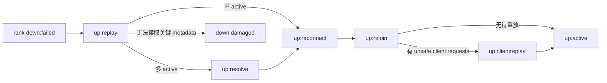

# CephFS 高可用、恢复与数据修复

## 1. 核心判断

CephFS 高可用由两组机制组成：

- **服务接管**：MON 检测 active MDS rank 失效，分配 standby；新 MDS 从 RADOS journal/cache state 恢复并让客户端 reconnect/replay。
- **数据冗余**：metadata/data pools 由 RADOS replicated/EC、PG peering、scrub 和 recovery 保护。

MDS standby 不保存权威副本，RADOS 也不自动重建所有 POSIX session/lock；只有两层配合才构成完整恢复。metadata pool 全副本丢失是 namespace 级灾难，不能靠“还有 standby MDS”解决。

## 2. MDS 故障检测与接管

v20.2.3 默认 MDS 每 4 s 向 MON 发 beacon；15 s 未收到会被标记 laggy。若有合适 standby，MON 更新 MDSMap，将其分配给 failed rank。

故障判定是基于 MON quorum 的 map epoch。旧 MDS 恢复后不能继续作为同一 rank 服务；client/MDS/OSDMap epoch 与 blocklist 防止旧 session 写入。

### 2.1 standby 类型

| 类型 | 状态 | 优点 | 代价/限制 |
|------|------|------|-----------|
| 普通 standby | `up:standby` | 可接管多个 FS/rank 中任一合适故障 | 接管后从 journal 开始恢复，cache 冷 |
| standby-replay | `up:standby_replay` | 实时跟随某 active rank journal，通常切换更快、cache 更热 | 只服务绑定 rank；每 active 最多一个；增加 RADOS read/cache 成本 |

如果启用 standby-replay，应为每个 active rank 配一个，否则某些 rank 有快速接管、另一些没有；此外仍可保留普通 standby 以覆盖第二故障。

### 2.2 容量规划

`max_mds=N` 只声明 N 个 active ranks。最小 HA daemon 数不是 N，而是：

```text
N active + 希望同时容忍的 MDS 故障数
```

若每 active 都配 standby-replay，再容忍额外故障，则 daemon 更多。必须跨主机/机架放置；把 active 与 standby 全放同一节点不构成硬件 HA。

## 3. failover 状态机



### 3.1 `up:replay`

读取该 rank journal，重建 subtree map、sessions、open inodes、dirty metadata 和已记录 operations。恢复时间取决于未 trim journal、RADOS latency、cache warming 与 damage；standby-replay 已跟随大部分日志，可缩短此阶段。

### 3.2 `up:resolve`

多 active FS 才需要。所有 ranks 协调未完成的 inter-MDS operations 与 authority，任一 rank 仍 failed/damaged/replay 都可能阻塞整体推进。

### 3.3 `up:reconnect`

等待旧 session 的客户端重连并上报持有 caps、locks/dirty state、unsafe requests。默认 45 s；超时客户端被 eviction/blocklist，未刷 buffered data 可能丢失。

客户端数、每客户端 cap 数与 session state 直接决定 failover 恢复成本，所以 `mds_max_caps_per_client` 不只是内存参数，也是 RTO 参数。

### 3.4 `up:rejoin`

把恢复 rank 的 cache 与其他 active MDS cache 重新连接，重建 inter-MDS locks/replicas/authority 关系。

### 3.5 `up:clientreplay`

客户端重发已 early-reply 但未确认 durable 的 unsafe requests。MDS 根据 journal/session/request ID 重放或识别已完成操作，之后进入 active。

## 4. 故障矩阵

| 故障 | 预期行为 | 数据/可用性风险 | 关键动作 |
|------|----------|-----------------|----------|
| active MDS process/host 故障 | standby 接管 rank，走恢复状态机 | metadata 暂停；未刷客户端数据取决于 session 能否重连 | 确保跨主机 standby，监控 replay/reconnect |
| MDS 网络隔离 | MON 标 laggy/替换，旧客户端 session 被 fencing | partition 两侧不应同时获权；旧客户端 dirty data 可丢 | 不手工取消 blocklist，重新 mount |
| 无 standby | rank 保持 `down:failed` | 对应 subtree/FS metadata 不可用 | 补足 standby，检查 affinity/compat |
| metadata pool slow/degraded | journal/cache miss/replay 变慢 | 全 FS metadata P99/RTO 上升 | 独立 NVMe、优先恢复 metadata PG |
| metadata PG 全副本丢失 | rank `down:damaged` 或 namespace 不一致 | 可能整 FS 不可访问/丢路径 | 停止 FS，备份 journal，专家恢复/备份回滚 |
| data PG 全副本/shards 丢失 | FS 仍可运行，受影响文件范围读出零 | 静默内容缺口需识别文件 | `cephfs-data-scan pg_files`，删除并从备份恢复 inode |
| data pool full | buffered write 延迟报 ENOSPC，数据操作受限 | 成功 write/close 后仍可能失败/丢弃 | 应用 `fsync`，保留容量，避免触 full |
| metadata pool full | 新 metadata/journal 操作受阻 | namespace 变更/恢复受影响 | metadata pool 独立水位与 emergency headroom |
| MON quorum 丢失 | 无法发布权威 maps/认证/故障切换 | 新连接和状态变化受阻，长期会停 I/O | 3/5 MON 跨故障域，先恢复 quorum |
| client 卡死持 caps | MDS slow ops/cache pressure | recall/lock 等待，尾延迟放大 | 诊断 client，按策略 eviction |
| 大批量删除 | Purge Queue backlog | 池空间迟迟不释放、OSD delete storm | 限速、监控 pq，与 scrub/recovery 协调 |

## 5. RADOS 层恢复

### 5.1 replicated pool

对象由 PG primary 协调多个 replicas，CRUSH 把副本放到 host/rack 等故障域。OSD down 后 PG degraded，满足 `min_size` 时可继续 I/O；长期 down/out 触发 recovery/backfill。`size`、`min_size` 和 failure domain 是可用性/持久性协议，不只是容量参数。

### 5.2 EC pool

data object 分成 `k` data + `m` coding shards。最多容忍多少 shard loss 取决于 profile 与故障是否跨独立 failure domains；degraded read 需重构，恢复网络/CPU/磁盘开销通常更高。metadata pool不能 EC。

### 5.3 scrub

OSD scrub/deep-scrub 校验 PG object replicas/shards 与 checksum；MDS scrub 校验 namespace 结构、dentry/inode/dirfrag/backtrace。两者互补：OSD 不理解完整文件层次，MDS 也不替代底层 replica checksum。

## 6. MDS scrub 与 damage table

MDS scrub 可从指定 path 递归执行，rank 0 负责协调并分发给其他 active ranks。它可检查：

- inode/dentry/dirfrag 缺失或不一致；
- inode backtrace 损坏；
- stray/orphan 状态；
- 部分 snapshot/hard-link 关系。

发现损坏记录在 damage table；repair scrub 成功后移除条目。damage table 让局部损坏可显式隔离，而不是一遇坏对象整个 daemon crash。默认 table 最大 10,000 entries，超过可能把 rank 标 damaged。

全量 scrub 本身是 metadata workload；应有窗口、速率、进度、失败重试与前台 SLO，不能只在事故时第一次运行。

## 7. journal 恢复工具

`cephfs-journal-tool` 可：

- 查看/导出/import journal；
- 列出 events；
- `recover_dentries` 把 journal 中版本更新的 inodes/dentries 写回 backing store；
- reset/truncate 无法 replay 的 journal。

正确原则：

1. FS 必须 offline；
2. 危险操作前先 export journal；
3. `recover_dentries` 结果不保证自洽，之后必须 scrub；
4. reset journal 会丢失尚未写回的 metadata，产生 orphan objects，甚至 inode number 重用风险；
5. 任一步失败都停止，不继续按“脚本清单”执行。

这些工具是灾难恢复手术，不是日常自动修复 API。

## 8. metadata table 与 map 恢复

per-rank `sessionmap`、`inotable` 和全 FS `snaptable` 损坏时，`cephfs-table-tool` 可 reset。副作用包括丢 session、要求客户端 remount、inode allocation/snapshot state 风险。

`ceph fs reset` 会把 MDSMap 收敛到单 rank 0 并尝试复用已有 RADOS metadata；其他 ranks 的 in-RADOS state 会被忽略，可能丢数据。它与删除重建 FS 不同，后者可能让 rank 0 进入 creating 并覆盖 root metadata。必须在专家指导下按事故证据选择。

## 9. 从 data pool 重建 metadata

当 metadata objects 丢失但 data pool 尚存，CephFS 利用第一个 object 的 backtrace 和对象命名做三阶段重建：

1. `cephfs-data-scan scan_extents`：扫描所有 data objects，计算 inode size/mtime；
2. `scan_inodes`：扫描每个文件第一个 object/backtrace，向新/修复 metadata pool 注入 inode；
3. `scan_links`：检查并修复 inode linkage。

可以按 worker 分片并行，但所有 `scan_extents` workers 必须完成后才能开始 `scan_inodes`。官方明确提示可能耗时非常长，且当前无可靠完成时间估算。

这条路径的限制决定了它不应成为日常 RTO 方案：

- 时间与 object count/文件大小成比例；
- backtrace/name/link 信息可能不完整，恢复项可能进入 `lost+found`；
- hard links、snapshots、ACL/xattr 和最近 journal-only metadata 可能受损；
- 重建后必须 scrub、人工验证并从备份补齐。

对万亿小对象，全池扫描的量级本身可能超过业务允许的 RTO。

## 10. data PG 丢失的特殊语义

官方文档指出 data pool PG 丢失时，FS 可继续运行，但文件受影响范围读取可能返回零。用 `cephfs-data-scan pg_files <path> <pg...>` 扫描 path/layout 来列出可能受影响文件；恢复时应删除损坏文件并从备份重新创建，不能原 inode 上覆盖，因为损坏/丢失 object 状态可能残留。

这是一个重要运维结论：cluster `HEALTH_OK` 恢复不自动说明所有文件内容完整，必须把 lost PG → affected file → backup restore 做成取证流程。

## 11. 恢复时间的主要变量

```text
MDS failover RTO ≈
  故障检测(默认最多约15s)
  + standby assignment/map传播
  + journal replay
  + inter-rank resolve/rejoin
  + clients reconnect(默认窗口45s)
  + unsafe request replay/cache warmup
```

影响变量：

- journal 长度和 trim 状态；
- metadata pool P99/P999；
- client/session/cap 数；
- active rank 数和未完成跨 rank operations；
- standby-replay 是否已 warm；
- OSD degraded/full/recovery 状态；
- 客户端网络和内核健康。

SLA 不应写成“有 standby，所以 15 秒恢复”；应通过故障注入实测分布，并分别记录 detect、replay、reconnect、active、应用恢复五个时间点。

## 12. 生产恢复演练

至少每季度验证：

1. kill active MDS process、断 MDS host 网络、整机掉电；
2. 普通 standby 与 standby-replay 的 RTO 差异；
3. 1k/10k 客户端或等价 caps 数下 reconnect；
4. 长 journal/trim warning 时 failover；
5. metadata pool degraded + MDS failover 叠加；
6. OSD blocklist 和 epoch barrier 是否阻止旧客户端写；
7. data pool full/nearfull 的 `write`、`close`、`fsync` 错误；
8. snapshot restore 与 mirror promotion；
9. scrub damage 注入与 damage table 处置；
10. 只在隔离测试集群演练 journal/data-scan 工具。

## 13. 对 LightStore 的启示

1. Meta Range Raft election 完成不等于应用恢复；需要 replay、lease invalidation、client retry 和 cache warmup 的可观察状态机。
2. failure detection、leader epoch 和 DataServer fence epoch 必须联动，防旧 writer 恢复。
3. journal/manifest 定期 checkpoint，限制最坏 replay 长度，并监控不可 trim 原因。
4. 数据记录保存 tenant/object/version/backpointer/checksum，支持从 volume 局部重建 metadata，但主恢复路径应依赖增量索引/备份而非扫 EiB 全池。
5. 区分 metadata damage、data fragment loss、logical orphan 和 stale placement，并为每类建立 damage table/reconciler。
6. 任何 destructive recovery tool 默认 offline、dry-run、导出备份、operation ID 和审计日志。
