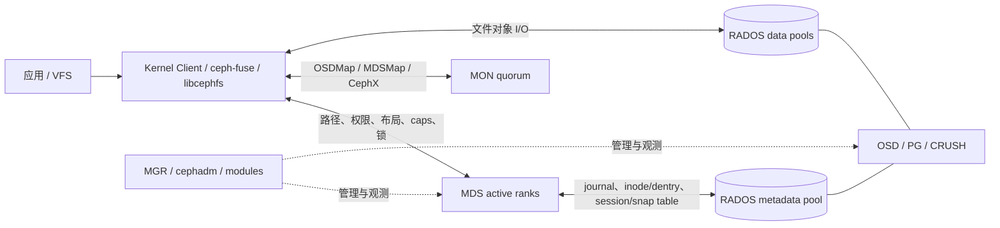

# CephFS 系统概览与架构

## 1. 定位

CephFS 是 Ceph 统一存储体系中的分布式文件服务。它把文件数据和持久元数据放进 RADOS，却在 RADOS 之上增加 MDS 集群来实现目录层次、inode/dentry、权限、锁、客户端缓存一致性、快照和故障恢复。客户端形态包括 Linux kernel client、`ceph-fuse`、`libcephfs`，上层还可接 NFS-Ganesha、SMB、OpenStack Manila 与 Ceph CSI。

CephFS 的性能目标是让稳态文件数据绕过 MDS：MDS 告诉客户端“文件是谁、布局是什么、允许做什么”，客户端再依照 OSDMap 与 CRUSH 直接访问 RADOS。官方 [CephFS I/O Path](https://docs.ceph.com/en/tentacle/cephfs/cephfs-io-path/) 明确指出 MDS 不参与文件内容 I/O。

## 2. 组件与职责

| 组件 | 关键状态 | 职责 | 不负责什么 |
|------|----------|------|------------|
| MON quorum | MonMap、OSDMap、MDSMap、CRUSHMap、认证/配置 | 集群成员与 epoch 权威、MDS rank 分配、故障判定、CephX | 不代理每次文件 I/O |
| MGR | 模块状态、指标、orchestrator | 管理/监控、volumes、mirroring、snap-schedule、cephadm 接口 | 不是 metadata consistency authority |
| MDS active rank | metadata cache、subtree authority、locks、caps、journal | namespace 操作、权限、布局、缓存授权、迁移、恢复 | 不承载文件内容数据流 |
| MDS standby | 可用 daemon 或指定 rank 的 replay follower | active rank 故障接管 | 普通 standby 不主动服务 namespace；standby-replay 也不是同时可写副本 |
| OSD/PG | RADOS objects、replica/EC shards、PG log | metadata/data object 持久化、复制/EC、scrub/recovery | 不理解完整 POSIX namespace |
| 客户端 | MDSMap、OSDMap、caps、dentry/inode cache、dirty pages | 路径解析、布局计算、直接对象 I/O、写回、reconnect/replay | 不能绕过 CephX/caps 任意访问对象 |

## 3. 控制面与数据面

这个分层有三个必须区分的“一致性域”：

1. MON 对 cluster maps 与 rank assignment 的 epoch 权威；
2. MDS 对某个 inode/subtree 的 metadata authority、locks 与 caps；
3. RADOS 对某个 PG 内对象变更的持久性、复制/EC 和恢复。

多 active MDS 只改变第二层的 authority 分区；metadata 的 durable redundancy 仍来自第三层的 replicated metadata pool。把“2 个 active MDS”理解成“双副本 MDS”是错误的。

## 4. 一次典型访问

### 4.1 路径与 open

1. 客户端从本地 dentry/inode cache 解析已授权部分；cache miss 时向相应 MDS rank 发请求。
2. 非 authoritative MDS 可用 read lock 服务部分读取，变更请求会转发到 authoritative MDS。
3. MDS 校验 CephX/MDS caps 与 POSIX 权限，返回 inode、file layout 和适当 caps。
4. 客户端在 caps 允许范围内缓存 metadata/data 或执行 buffered write。

### 4.2 文件数据 I/O

1. 客户端把文件 offset 按 `stripe_unit`、`stripe_count` 和 `object_size` 映射到 RADOS object。
2. 通过对象名、pool、namespace 计算 PG。
3. 使用 OSDMap 与 CRUSH 计算 acting set/primary OSD，不需要中央对象位置查询。
4. 对 primary OSD 发起读写，RADOS 在 replicated 或 EC 规则下完成操作。

### 4.3 metadata 变更

1. authoritative MDS 获取需要的分布式锁并 recall 冲突 caps。
2. 变更先形成 journal event，写入 metadata pool；多个事件可以批量、顺序写。
3. `mds_early_reply=true` 时，MDS 可在操作完成但 journal 尚未 durable 时先回复；客户端把它保留为 unsafe request。
4. journal commit 后 MDS 通知客户端，之后把变化批量写回持久 dirfrag/inode 对象并 trim journal。

因此 metadata 操作的“用户已看见”和“journal 已持久”可能是两个时点，但 failover 协议通过客户端重发 unsafe request 与 request ID 去重完成恢复，而不是假定早回复已经持久。

## 5. 两个池不是简单的冷热分层

一个 CephFS 至少需要：

- **metadata pool**：inode、dentry、目录层次、各 rank journal、session map、inode table、snap table 等；必须 replicated，因为 OMAP 不能放在 EC pool。官方建议至少 3 副本，并使用低延迟 SSD/NVMe 和独立 device class。
- **default data pool**：文件对象和所有 inode 的 backtrace。即使某个目录把用户数据定向到另一 EC pool，默认 data pool 仍承载第一个对象/backtrace，因此官方建议默认池也用 replicated，以避免小对象更新的 EC 成本。

可以附加多个 data pool，并在目录上用 layout xattr 为新文件选择 pool；layout 是创建时继承，之后修改父目录不会迁移已有文件。不同 CephFS 不应共享池，官方管理命令会阻止这种危险配置。

## 6. 扩展方式

### 6.1 数据容量与带宽

增加 OSD 和故障域，CRUSH/PG 负责放置与 rebalance。客户端直连 OSD，使聚合大文件带宽不经过 MDS。但实际扩展受网络、PG 数、CRUSH rule、OSD media、recovery/scrub、EC 参数和客户端并发限制。

### 6.2 metadata throughput

主要手段是：

- 为 MDS 提供低延迟 CPU、足够内存与高速 metadata pool；
- 增大 MDS cache 以覆盖热点 working set；
- 增加 `max_mds`，让多个 rank 通过动态子树负载均衡分担工作；
- 用 export pin/ephemeral pin 做工作负载隔离；
- 让大/热目录自动分裂成 dirfrags，再把 fragment 分布到不同 rank；
- 改善 namespace 设计，避免所有客户端争用少数 inode、目录和 caps。

官方指出 MDS 大部分工作仍是单线程，繁忙 daemon 常只消耗约 2–3 个 CPU core；因此更高主频和更低延迟通常比盲目增加单 daemon 核数有效。多个 active rank 只有在 workload 能按目录/dirfrag 并行时才提升吞吐，单客户端串行 metadata 流通常不会线性受益。

### 6.3 租户与协议扩展

- **subvolume** 是目录树管理抽象，可绑定 quota、layout、snapshot 和 CephX path caps；不是独立文件系统或独立 metadata pool。
- **multiple file systems** 提供独立 pool、MDS ranks 与 snapshot ID 空间，隔离更强但运维成本更高。
- **NFS/SMB gateway** 增加协议兼容，但 I/O 会经过 gateway，性能、一致性和 HA 故障域与原生客户端不同。

## 7. 典型优势

1. 原生共享 namespace 和较强的多客户端 cache coherence。
2. 数据直达 RADOS，容量、带宽、复制、EC、checksum 和设备故障域统一治理。
3. metadata authority 能动态移动，超大目录也可以在目录内分片。
4. MDS 本机不保存关键 metadata，standby 可通过 RADOS journal 接管。
5. 快照、subvolume、CSI/Manila、NFS/SMB 和 Ceph 统一运维生态完整。
6. scrub、damage table、journal/data scan、backtrace 和恢复工具形成较完整诊断闭环。

## 8. 结构性代价

1. CephFS 正确性横跨客户端、MON、MDS、OSD 与网络 epoch，排障门槛高。
2. metadata 性能高度依赖 MDS cache；工作集不命中时会暴露 metadata pool 延迟。
3. 强缓存一致性引入 cap recall、client eviction 和 failover reconnect 的状态量。
4. 小文件不会默认 inline/packing；experimental inline data 小于约 2 KiB 且已 deprecated，不应作为生产小文件优化路径。
5. 删除与快照回收异步，namespace 空闲不等于物理容量即时释放。
6. 全池灾难恢复时间随对象总量增长，不适合把恢复目标建立在“事后扫完整个 EiB 池”。
7. Ceph 是共享底座；RBD/RGW/CephFS 共用 OSD 时可能产生 noisy neighbor 和更大的变更 blast radius。

## 9. 适用与不适用

### 更适合

- 需要 Linux 原生共享挂载和成熟 POSIX 子集的 HPC/AI、科研、媒体处理、home/project 目录。
- 已具备 Ceph 运维能力，希望同一 RADOS 集群同时提供 block/object/file。
- Kubernetes RWX、OpenStack Manila 等需要动态 subvolume 的场景。
- namespace 可按项目/租户/作业分散，metadata working set 可由 MDS cache 覆盖。

### 需要谨慎

- 超大单目录、高冲突 shared-write、数百万客户端或 cap 数无法治理的场景。
- 对共享 writable `mmap`、跨对象写原子性、严格 atime 或零 RPO 双站点有硬要求。
- 海量几 KiB 对象以空间效率和快速全量恢复为首要目标。
- 团队不愿承担完整 Ceph、内核客户端与 gateway 版本矩阵运维。

### 不应仅凭功能表决策

“支持多 MDS、EC、快照、配额、镜像”只说明功能存在，不代表目标 workload 下达到线性扩展、硬配额、同步快照或零 RPO。选型必须把这些词还原成本文后续各章描述的具体协议与故障语义。
