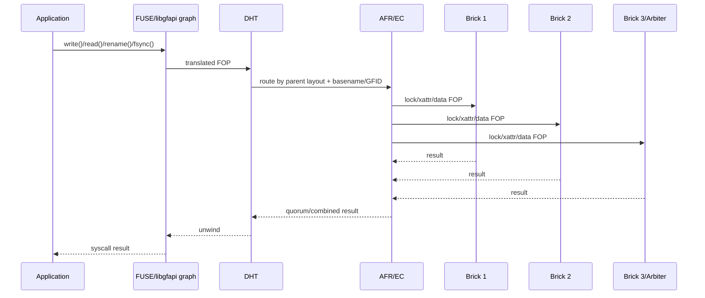

# GlusterFS 读写路径、复制与纠删码

## 1. 路径总览

GlusterFS 的数据路径可以用一句话概括：**客户端把一个 POSIX FOP 经过多层 translator 转换、选路和扇出，brick 再把它还原为本地 VFS 操作**。



这条路径没有中心 allocation/metadata RPC，但一个应用 syscall 可能变成多轮、多个 bricks 的 RPC。延迟应按 translator 展开分析，而不是只测网络 ping。

## 2. Bootstrap 与连接建立

Native client mount 的大致过程：

1. 连接命令指定的 volfile server（通常是某个 `glusterd`）；
2. 请求 volume 的 client volfile 和 op-version；
3. 装载 translators、构造 graph；
4. protocol/client translator 分别连接相关 brick ports；
5. 收到 child up/down 事件，DHT/AFR/EC 建立可用视图；
6. FUSE mount 开始接收 VFS 请求。

从 Gluster 10 开始 brick ports 在 `base-port..max-port` 范围内随机选择。防火墙只放行 24007 而未放行实际 brick ports，会表现为“能拿到 volfile、mount/CLI 看似正常，但 I/O 子卷 ENOTCONN”。

生产挂载至少需要：

- 主/备 volfile servers；
- hostname/DNS 在全体 clients 一致可解析；
- 管理端口与 brick 端口显式 ACL；
- client process、brick connection 和 child-up 数量监控；
- 对 42 s ping timeout 与 1800 s frame timeout 的应用超时协调。

## 3. Lookup/Open/Read 路径

### 3.1 路径解析

对 `/a/b/file`，客户端逐级获得 GFID/inode 与 directory layout。已有 cache 时可省去部分 lookup；cache miss 时每一级都可能访问远端。

最后一级常规 lookup：

1. DHT 用 `/a/b` 的 layout 和 basename `file` 算 hashed subvolume；
2. 在该 child 做 lookup；
3. AFR/EC child 向所需 bricks 查询 GFID、stat、pending/dirty/readability；
4. 如果是正常对象，建立 inode context/read child；
5. 如果是 DHT linkfile，跳到 linkto 指定 child；
6. 如果 hash miss 且不能安全判 negative，查询其他 children；
7. 如果发现 missing replica/dirty 状态，可触发 background/self-heal 检查。

### 3.2 AFR read selection

AFR 不需要每次从全部 replicas 读取 file data。它先用 lookup/transaction 状态确定哪些 children 有 readable/fresh copy，再选择一个 read child。

v11.2 重要默认：

- `read-hash-mode=1`：按 GFID hash，通常让不同 clients 对同一文件选择相同 child；
- `choose-local=true`：未显式指定时优先本地 brick；
- 也支持按 client PID、outstanding reads、network latency 或混合模式选 child。

这能分摊不同文件读取，但**单次 read 不是 quorum read**。正确性依赖 AFR 先排除 stale/accused child；发生无法裁决的 split-brain 时应失败或要求显式选择 source，而不是通过随机读掩盖冲突。

### 3.3 EC read

Disperse volume 需要任意 `K=N-R` fragments：

- 健康状态按 GFID hash/round-robin 选择 `K` 个 children；
- 读各 fragment 对应范围；
- 客户端使用 GF(2^8) matrix 解码逻辑数据；
- 缺不超过 `R` fragments 时 degraded read 仍可完成，但要增加网络与 CPU；
- 缺失超过 `R` 或可用结果不构成 required quorum 时 FOP 失败。

即使读的是“data-like fragment”，Gluster EC 使用的编码/布局不能被应用当作普通 RAID 成员直接读取。

### 3.4 Quick-read 与 page cache

默认 client graph 通常装载 quick-read，可让小文件内容随 lookup 返回并缓存；FUSE 还涉及 kernel page/attribute cache。它们减少 RPC，但带来：

- client 内存放大；
- 跨 client 修改后的 invalidation/timeout 路径；
- 故障切换后旧 cache 的重验证；
- benchmark 热 cache 与真实冷读的巨大差异。

性能测试必须分别报告 cold/warm cache，并通过超过总 cache 的 working set 或 drop/restart client 验证。

## 4. Create/Write 路径

### 4.1 DHT 选择一个 redundancy set

对新文件 create：

1. DHT 读取/缓存 parent layout；
2. hash basename 选择一个 AFR/disperse subvolume；
3. 对目标 child 执行 create，分配统一 GFID；
4. 后续 write 根据 inode context 直接进入同一 child；
5. 文件不会因为 DHT 自动跨多个 sets striping。

低空间时 DHT 可把文件放到非 hashed child，并在 hash 位置建立 linkfile。这能避免单 brick 先满，但会让后续 lookup 增加跳转，且不会替代主动 rebalance。

### 4.2 AFR write transaction

AFR 把 FOP 分为 data、metadata、entry 等 transaction。以 regular file write 为例，概念流程是：

```text
1. lock:
   在当前可用 replica children 上获取 internal file/region lock
2. pre-op / dirty marking:
   标记 transaction in-flight，建立 crash 后可发现的索引/xattr
3. FOP:
   向 eligible replicas 并行执行 writev
4. post-op:
   清理成功 children 的 dirty/pending；失败 child 保持被 blame/pending
5. durability:
   ensure-durability=on 时执行协议需要的持久化动作
6. unlock:
   释放或由 eager-lock 暂时复用内部锁
7. unwind:
   根据成功数、quorum 和错误优先级返回应用
```

内部 locks 有两个目的：

- 防止两个 clients 在不同 replicas 上以不同顺序应用重叠 writes；
- 让 pending xattr 的 source/sink 判定与数据变化处于一致 transaction 边界。

默认 eager-lock 尝试获得整文件锁并让相邻 writes “接力”复用，减少锁 RPC；出现竞争时退回顺序阻塞/区域锁。它提升单 writer 连续写，却可能让多 writer 热文件的锁等待更明显。

### 4.3 什么叫“同步复制”

AFR 同步复制的正确解释是：**一个 client transaction 会在返回路径中处理当前 eligible replicas 的结果，不是写入本地后由后台日志异步复制**。但应用成功所要求的成功数由 topology/quorum 决定：

- 未配置有效 client quorum 时，只要协议仍有可接受的成功 child，故障 child 可被标记 pending，之后 self-heal；
- `quorum-type=auto/fixed` 时，不达到所需 bricks 数量则 FOP 失败；
- arbiter 不保存 file data，但参与 entry/metadata/xattr 与仲裁；
- write 返回不自动等价于应用调用了 `fsync`，还可能受 write-behind 影响。

因此，“3 replicas”不能单独定义 durability contract；还必须写明 quorum、write-behind、fsync、brick backend cache 和 failure acknowledgment。

### 4.4 EC write 与 read-modify-write

Gluster disperse 使用 Reed-Solomon over GF(2^8)。令：

```text
N = total fragments
R = redundancy fragments
K = N - R = minimum fragments to decode
fragment unit = 512 bytes
logical stripe = 512 × K bytes
```

完整 stripe 写可直接编码 N fragments。partial stripe write 必须：

1. 锁定相关 inode/stripe；
2. 从至少 K children 读旧 fragment；
3. 解码/合并新字节；
4. 重新编码受影响 fragment；
5. 向 N children 写更新；
6. 根据 quorum/错误更新 dirty/heal 状态。

这就是 EC 随机小写的 RMW 放大。v11.2 用以下机制缓解而非消除：

- eager lock 默认保留 1 s 以复用连续操作；
- 每 open file 默认缓存最近 4 个 stripes；
- 不修改同一 stripe 的 writes 可并行；
- CPU extension 自动选择 x64/SSE/AVX 编码实现。

选择 `N/R` 时应让 `512×K` 是常见 I/O block 的因数/2 的幂。例如官方文档把总 6、R=2、K=4、stripe=2048 B 视为较优组合。真正数据库/VM workload 仍必须测 4 KiB random write、fsync 和 degraded mode。

## 5. Write-behind、Flush、Fsync 与 Close

### 5.1 默认 write path 可以先返回

v11.2 管理面默认把 write-behind translator 装入 client graph，单文件默认 window 为 1 MiB。write-behind 可以在 child AFR/EC/brick 回复前先向 FUSE/application unwind `write()`，再异步完成下层 FOP。

这意味着：

- `write()` 成功只说明数据被 client graph 接受，不能证明 replica disks 已持久；
- delayed write error 可能在后续 write、flush、fsync 或 close 才暴露；
- client 进程崩溃与 brick 崩溃是不同 durability failure；
- benchmark 如果只计 `write()` completion，会高估 durable throughput。

### 5.2 `flush` 不是 `fsync`

FUSE close 会产生 flush/release 等动作；write-behind 的 `flush-behind=on` 可让 flush 本身在后台继续。应用若需要 durable commit，必须明确调用 `fsync/fdatasync` 并检查返回值，不能把 `close()` 或进程退出当作严格 durability barrier。

### 5.3 `fsync` 的完整检查

一次成功的应用 durability 测试应同时验证：

1. write-behind 队列已排空；
2. AFR/EC 在要求的 quorum/all eligible children 上完成 data transaction；
3. backend `fsync` 成功；
4. application 收到成功；
5. 随后立即 kill client、brick、node/断电后重启，读取 checksum 仍正确；
6. 故障 child 恢复后的 self-heal 不把旧副本覆盖新副本。

`cluster.ensure-durability=on` 是重要保护，但不能替代应用层 `fsync` 契约。

## 6. Sharding：把单个大文件变成多个 backend files

### 6.1 目的与格式

Sharding translator 默认关闭。启用后，一个逻辑大文件按默认 64 MiB block 分拆：

- block 0 由 base file 表示；
- 后续 blocks 存在隐藏 `.shard` namespace，名称带 base GFID 和 block number；
- translator 聚合 size/stat/truncate/unlink/fsync；
- 每个 shard 作为 backend object 可独立走 DHT/AFR。

主要用途是 VM image 等大 sparse/random-write file，避免整个超大文件成为一个迁移/heal 单元，并可能让 shards 分布到不同 DHT sets。

### 6.2 收益与代价

| 收益 | 代价 |
|------|------|
| 单 shard heal/迁移而非全文件 | 一个逻辑文件变成大量 backend inode/GFID/xattr |
| 不同 blocks 可分布和并行 | rename/unlink/truncate/fsync 要维护 base 与所有 shards |
| 降低单个 backend file 大小 | `.shard` 隐藏 namespace、LRU 和清理 backlog |
| 改善 VM image 某些 workload | 历史上 rebalance+shard 出现过数据损坏，必须以 v11.2 做专项故障测试 |

不能把 sharding 等同于成熟的 object/chunk metadata layer。它仍通过 client translator 和隐藏文件模拟一个逻辑 inode，缺少中心 transaction record。

## 7. Metadata/Directory FOP 路径

| FOP | DHT 行为 | AFR/EC 行为 | 主要放大 |
|-----|----------|-------------|----------|
| `stat` | hash/linkfile 路由 | 选 readable child/比对状态 | cache miss、stale 检查 |
| `mkdir` | 向全部 DHT children 创建相同 GFID + layout | 每 child 内复制/编码 metadata | children × replica width |
| `readdirp` | 读所有 children 并合并/过滤 | 为 entries 选 stat/read child | 最慢 brick + 大量 stat |
| `rename(file)` | 同/跨 hashed child，可能建 linkfile/搬数据 | entry transaction 与 locks | 双目录、多 children、rollback |
| `rename(dir)` | 所有 children 保持 path/GFID | directory entry heal | 全 children 协调 |
| `unlink` | 删除 data/linkfile，处理 migration 状态 | entry+data transaction，shard 则后台清理块 | namespace 和隐藏对象回收 |

## 8. 故障中的数据路径

### 8.1 Brick connection 断开

protocol/client 产生 child-down，AFR/EC 重新计算可用 children：

- 满足 quorum/最少 fragments：允许相应 FOP，记录 pending/heal；
- 不满足：返回 ENOTCONN/EIO 等错误；
- outstanding frame 可能等待 ping/frame timeout 或由 translator 提前失败；
- brick 恢复产生 child-up，触发 lookup/index heal 检查。

### 8.2 Client 断开

brick 上属于该 client connection 的 locks 会清理。protocol client 可在重连后 reopen saved fds；`strict-locks` 默认关闭，持有 POSIX locks 的 fd 也可能走 reopen 路径。依赖锁在网络重连后仍连续有效的应用必须单独测试，并考虑启用 strict behavior 让失败显式化。

### 8.3 部分成功

数据 path 的关键不是简单“成功/失败”，而是：

- 应用是否已收到成功；
- 哪些 children 执行 FOP；
- 哪些 children 的 pending/dirty xattr 成功落盘；
- 是否仍有唯一 source；
- 是否达到 quorum；
- 后续 read 选择了谁；
- heal 是否可能安全判 source/sink。

AFR/EC 的 xattr/index 正是为了保存部分成功后的恢复线索。人工清除它们会把“可恢复的不一致”变成“无法证明正确副本”。

## 9. I/O 放大模型

以下是逻辑模型，不是性能实测：

| 操作 | Distributed | Replica 3 | Arbiter 2+1 | EC N=6,R=2 |
|------|-------------|-----------|-------------|------------|
| 大顺序 write | 1 data target | 3 data copies + locks/xattrs | 2 data copies + arbiter metadata | 6 fragments + encode + locks |
| 小随机 overwrite | 1 local write | 3 writes + transaction | 2 writes + arbiter transaction | read old K + encode/write N（最坏） |
| read | 1 target | 1 readable replica（常态） | 1 data replica | K fragments + decode |
| mkdir | 全 DHT children | 全 children × 3 metadata copies | 全 children × 3 entries/xattrs | 全 children × N metadata fragments/FOP |
| heal | 无源 | source read + sinks write | data/metadata 分开 | K reads + missing fragment reconstruction |

这个表解释了为什么 GlusterFS 不应只用“副本 3 理论 3x、EC 1.5x”做 TCO：metadata、network FOP、locks、xattr、heal 与 rebalance 的放大同样重要。

## 10. 数据路径设计评价

### 10.1 优点

- 稳态 direct-to-brick，没有中心 chunk lookup；
- translator 可组合，能针对 FUSE/gfapi、replica/EC 和 workload 插入功能；
- native backend 文件使普通工具可取证；
- AFR 把部分成功显式记录在 per-file xattr/index；
- DHT、AFR 和 EC 的 failure domain 组合直观。

### 10.2 结构性代价

- 每个客户端都是 placement/replication protocol participant；
- 一个 syscall 展开为多轮 distributed locks/xattr/data FOP；
- 延迟和 correctness 依赖 client graph 版本及配置一致；
- large namespace 操作随 DHT children 扇出；
- EC partial write 和 AFR multi-writer lock contention 明显；
- write-behind 使应用完成语义和底层 durability 分离；
- 没有服务端共识日志统一记录 namespace/data transaction。
