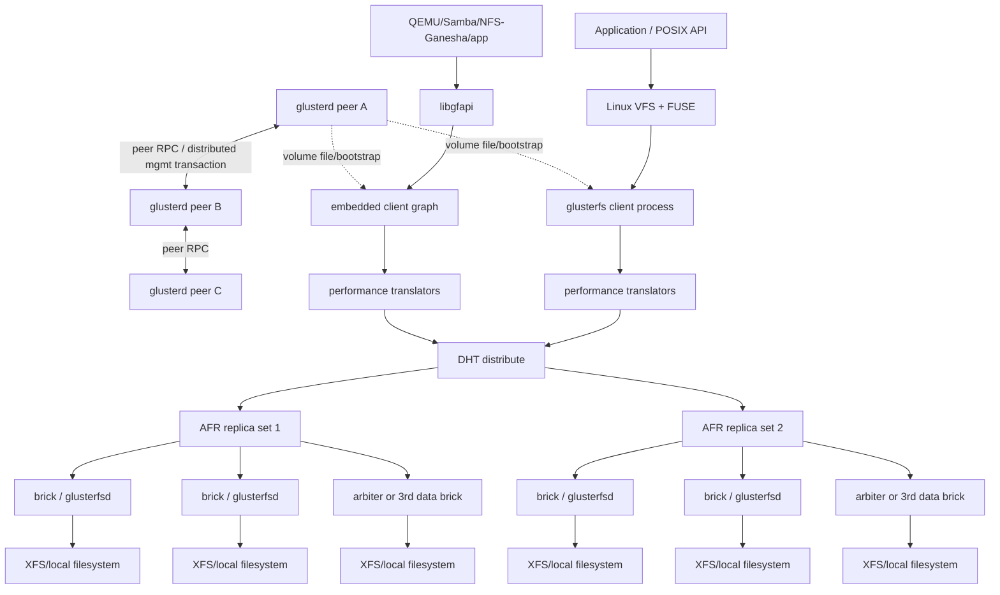

# GlusterFS 系统概览与拓扑

## 1. 一句话架构判断

GlusterFS 不是“一个元数据服务加一组数据节点”，而是**由管理面生成 translator graph、由每个客户端执行路由/复制/EC、由 brick 以普通文件落盘**的 scale-out 文件系统。

稳态 I/O 中没有 `glusterd`、集中 MDS 或 placement lookup service：客户端从任一 volfile server 获取 volume graph 后，建立到目标 bricks 的 RPC 连接并直接发 FOP（File Operation）。这种架构把中心瓶颈换成了客户端复杂度、目录扇出、分布式锁和重平衡复杂度。

## 2. 组件与数据流



### 2.1 `glusterd`：对等控制面

每个 trusted storage pool 节点运行一个 `glusterd`，职责包括：

- peer probe/detach 与 trusted pool 成员状态；
- volume/brick/topology/option 配置；
- 生成 client、brick、SHD 等进程使用的 volfile；
- 启停 brick、rebalance、self-heal、quota、snapshot、geo-rep 等服务；
- 跨 peers 对管理命令加锁并执行分布式事务。

`glusterd` 不是 I/O proxy，也没有一个常驻 leader。任意 peer 通常都可接受 CLI 命令，再协调其他 peers。它的原子管理操作依赖分布式锁与阶段协议，不是 Raft/Paxos replicated state machine。官方故障排查中出现的 “another transaction is in progress” 和 “locking failed” 正是这条路径的外部表现。

**工程含义**：数据面可在部分管理面故障时继续，但配置分歧、peer 网络分区和并发运维命令需要单独处理。server quorum 只是在失去管理节点多数时停止相关 bricks 的保护措施，不提供 per-file 一致性。

### 2.2 brick / `glusterfsd`：简单但有状态的文件服务端

brick 是 `host:/export/path`，由 `glusterfsd` 导出一个后端目录。server translator graph 负责：

- RPC authentication 和 client connection；
- POSIX/inode/entry locks；
- AFR/EC heal index、changelog/marker/bitrot/quota 等 server-side 元数据；
- io-threads 和 POSIX translator；
- 最终以发起请求用户的 UID/GID 调用本地 VFS。

“后端是普通文件”不代表 brick 无 Gluster 状态。文件和目录上的 trusted xattr、`.glusterfs` GFID handle、heal index、linkfile、shard hidden entries 都属于系统元数据，缺失或被人工修改会破坏 namespace 和恢复逻辑。

### 2.3 client：数据面的大脑

Native FUSE client 是独立 `glusterfs` userspace 进程；libgfapi 把同类 graph 嵌入应用。客户端负责：

- 路径/GFID/inode/fd 缓存；
- DHT placement 与 lookup fallback；
- AFR quorum、read child、内部锁、同步复制和 heal 触发；
- EC fragment 选择、RMW、编解码和 quorum；
- write/open/quick-read 等性能 translator；
- 与每个相关 brick 建立/维护 RPC 连接。

因此，升级客户端不只是换一个挂载工具，而是在替换数据面协议实现。生产矩阵必须同时约束 server 和全部 native/libgfapi/gateway client 版本。

### 2.4 后台进程

| 进程/功能 | 作用 | 关键风险 |
|-----------|------|----------|
| `glustershd` | replicate/disperse 的 index/full self-heal | heal backlog 与文件数、brick IOPS 强相关 |
| rebalance process | 修复 DHT layout 并迁移文件 | 与前台竞争磁盘/网络/锁；需要额外容量 |
| `glusterfsd` brick mux | 一个进程可承载多个 bricks（视配置） | 降进程数，但扩大单进程故障域 |
| `quotad` | 聚合/查询 quota usage | cache 造成短时 overshoot；故障影响 quota 操作 |
| bitrot signer/scrubber | 生成并核验 SHA-256 signature | 默认关闭；开启后消耗全量扫描带宽 |
| geo-rep `gsyncd` | changelog/rsync 异步站点复制 | 不是同步 HA；worker/checkpoint/backlog 需独立监控 |
| snapd/management snapshot | 暴露 LVM thin snapshots | 受 backend snapshot 一致性和空间约束 |

## 3. Volume 是 translator 组合，不是独立存储容器

Gluster volume 描述一棵逻辑 graph。对 distributed-replicated volume：

```text
                      DHT
             ┌─────────┴─────────┐
          AFR set 0           AFR set 1
       ┌────┼────┐          ┌────┼────┐
      B0   B1   B2          B3   B4   B5
```

- DHT 只在 **AFR subvolumes** 之间选一个目标；
- AFR 再把一个文件复制到该 set 内的 bricks；
- 一个文件不会因 DHT 分布而跨所有 sets 拆块；
- 目录通常必须出现在全部 DHT subvolumes，以保存 namespace 和每目录 layout。

distributed-dispersed volume 同理，只是 DHT 的 child 是 EC disperse set。

## 4. Volume 类型与失效语义

设每个 brick 的可用容量均为 `B`，先忽略本地文件系统、xattr、heal index 和预留空间开销。

| 类型 | 示例拓扑 | 逻辑容量 | 单文件布局 | 主要故障语义 |
|------|----------|----------|------------|--------------|
| Distributed | 4 bricks | 约 `4B` | 文件只在一个 brick | 无冗余；该 brick 故障就丢失/不可访问它承载的文件 |
| Replicated | replica 3 | 约 `B` | 3 份完整文件 | quorum 下可容忍 1 brick 故障继续服务；更多故障通常不可用 |
| Distributed-Replicated | 2 × replica 3 | 约 `2B` | DHT 选 1 个 set，set 内 3 份 | 故障影响按 replica set 隔离；同一 set 全失效只影响其文件 |
| Arbiter | replica 2 + arbiter 1 | 约 `B` 数据 | 2 份数据 + 1 份 namespace/xattr | 以约 2x 数据空间获得仲裁；arbiter 不能作为数据恢复源 |
| Dispersed | `N=6, R=2, K=4` | 约 `4B` | 每文件编码成 6 fragments | 最多缺 2 fragments 仍可服务；第 3 个不可用会使 set 不可服务 |
| Distributed-Dispersed | M × `(K+R)` | 约 `M×K×B` | DHT 选 1 个 EC set | 扩展容量并把 EC 故障域隔离到 set |

### 4.1 为什么纯 Distributed 不应承载唯一数据

它只有 DHT placement，没有副本或 EC。replace/remove 错误、brick 永久丢失或后端损坏会直接使一部分 namespace 无恢复源。适用范围只应是可重建 scratch/cache，且应用已经有外部副本。

### 4.2 replica 2 的根本约束

两个数据副本发生网络分区时，不存在能同时满足以下三者的配置：

1. 任一单侧仍可写；
2. 两侧不会同时接受冲突写；
3. 不增加第三个仲裁信息源。

关闭 quorum 可以保可用性但会产生 split-brain；要求两个都在线则失去单故障写可用。生产数据应优先 replica 3、arbiter 或 thin arbiter，并把 failure domain 放在不同节点/机架/站点。

### 4.3 Arbiter 与 thin arbiter 不是同一个东西

- **Arbiter brick** 属于每个 replica set，保存每个文件/目录的 entry、metadata 和 AFR xattr，但不保存 file data；判断粒度可到文件。
- **Thin arbiter** 是额外 witness service，通过 replica-id xattr 记录一对 data bricks 哪个整体为好/坏；粒度是 brick pair。常态不参与数据 I/O，发生故障时参与选择。

Thin arbiter 的低成本来自较粗判断：一旦某 data brick 上有未 heal 状态，它可能对其他健康文件也采取保守失败。不能只按“第三节点更小”比较，而要把故障期可用性纳入 SLO。

### 4.4 EC 的容量效率不是免费收益

Gluster disperse 使用 Reed-Solomon，`N=K+R`：

- 任意 `K` fragments 可解码；
- 理论 usable capacity 为所有等容量 bricks 中 `K` 份；
- `R` 必须小于 `N/2`；
- 当前 stripe size 为 `512 × K` bytes；
- 非完整 stripe 写要 read-modify-write；
- metadata/entry FOP 仍要在多个 bricks 之间锁与协调。

例如 `6+2` 不是“6 data + 2 parity”，Gluster CLI 常用含义是 **总共 6 bricks、redundancy 2、K=4**。文档和容量表必须明确 `N/K/R`，避免把物理数与数据片数混淆。

## 5. 接入方式

### 5.1 Native FUSE

```bash
mount -t glusterfs server1:/volname /mnt/gluster
```

初始 server 用于获取 volfile；客户端随后直连实际 brick。生产挂载应配置 backup volfile servers、明确网络超时，并监控 userspace client 进程，而不能只看内核 mount 存在。

优势：兼容普通 POSIX 应用。代价：VFS↔FUSE userspace context switch、每客户端 graph/cache/connection、client 版本管理。

### 5.2 libgfapi

QEMU、Samba VFS 模块或应用可绕过 FUSE，用 libgfapi 直接调用 Gluster。它减少内核/userspace 往返，也能保留 direct-to-brick graph；但应用进程崩溃域与 Gluster client graph 合并，版本/线程/事件循环/credential integration 需逐项测试。

### 5.3 NFS/SMB gateway

NFS-Ganesha 和 Samba 可用 libgfapi 或 mount 访问 Gluster，再向外暴露标准协议。它们引入：

- gateway HA 与 client session/failover；
- NFS state、SMB oplock/lease 与 Gluster locks 的双层一致性；
- gateway 带宽/CPU 瓶颈；
- 身份、ACL 和 group resolution 映射。

因此，“Gluster 支持 NFS/SMB”不等于共享一个虚拟 IP 就具备完整 HA。

## 6. 正确的扩展性理解

### 6.1 可随 brick 数扩展的部分

- 不同文件经 DHT 分布到不同 replica/disperse sets；
- 不同客户端可并行直连不同 bricks；
- 单文件读可在 AFR replicas 之间按 GFID/locality 等策略选 read child；
- 多文件 workload 的容量和聚合带宽可以随 sets 增长。

### 6.2 不会线性扩展的部分

- 一个普通文件只属于一个 DHT subvolume，单文件带宽受一个 AFR/EC set 限制；
- 目录存在于所有 DHT subvolumes，mkdir/rmdir/readdir/layout heal 成本会随 sets 增长；
- 单热目录仍受目录锁、单 brick namespace IOPS、client merge 开销影响；
- 每个客户端连接所有/大量 bricks，client × brick 的连接和 graph state 会增长；
- full heal、rebalance、bitrot scrub 的总工作量与文件数/数据量增长；
- management transaction 仍需协调 trusted pool peers。

## 7. 适用与不适用场景

### 7.1 相对适合

- 中大文件、不同文件可并行分布的共享文件 workload；
- 希望 brick backend 保持普通文件，便于本地取证；
- 已有成熟 Gluster 运维和固定发行包维护来源；
- 能把客户端、brick 和管理流量放在受控低延迟网络；
- 能使用 replica 3/arbiter/合理 EC failure domain；
- 可接受扩容后显式 rebalance 和 heal backlog 运维。

### 7.2 高风险或不适合

- 数十亿到万亿级小文件、频繁 full namespace 操作；
- 单目录极高 create/unlink/list QPS；
- 数据库/VM 随机小写但未完成专门 sharding/fsync/failure PoC；
- 跨高 RTT 站点做同步 replica；
- 零信任多租户、默认要求细粒度强身份与 at-rest encryption；
- 需要明确 LTS/CVE SLA 的 2026 新项目；
- 要求 metadata/data 路径线性一致并由服务端共识明确裁决。

## 8. 与常见误解的区别

| 误解 | 实际情况 |
|------|----------|
| “无元数据服务器，所以没有元数据” | 元数据分散在每个 brick 的目录、本地 inode/xattr、`.glusterfs` 和客户端 cache 中 |
| “每个文件都分散到全体 bricks” | DHT 选择一个 replica/disperse set；普通 replicated 文件只在该 set 内完整复制 |
| “加 brick 后立即获得均衡性能” | 既有目录 layout 和数据需要 fix-layout/rebalance |
| “replica 2 能容忍任意单节点故障且绝不脑裂” | 没有第三仲裁者时 CAP 约束不可消失 |
| “arbiter 是第三份小数据副本” | 它没有 file data，不能恢复两个 data bricks 同时丢失的数据 |
| “geo-rep 是跨站同步副本” | 它是 changelog/rsync 驱动的异步复制 |
| “brick 上是普通文件，可以直接改” | 直接修改会绕过 GFID、AFR/EC、changelog、bitrot 和 heal 状态，可能造成永久不一致 |
